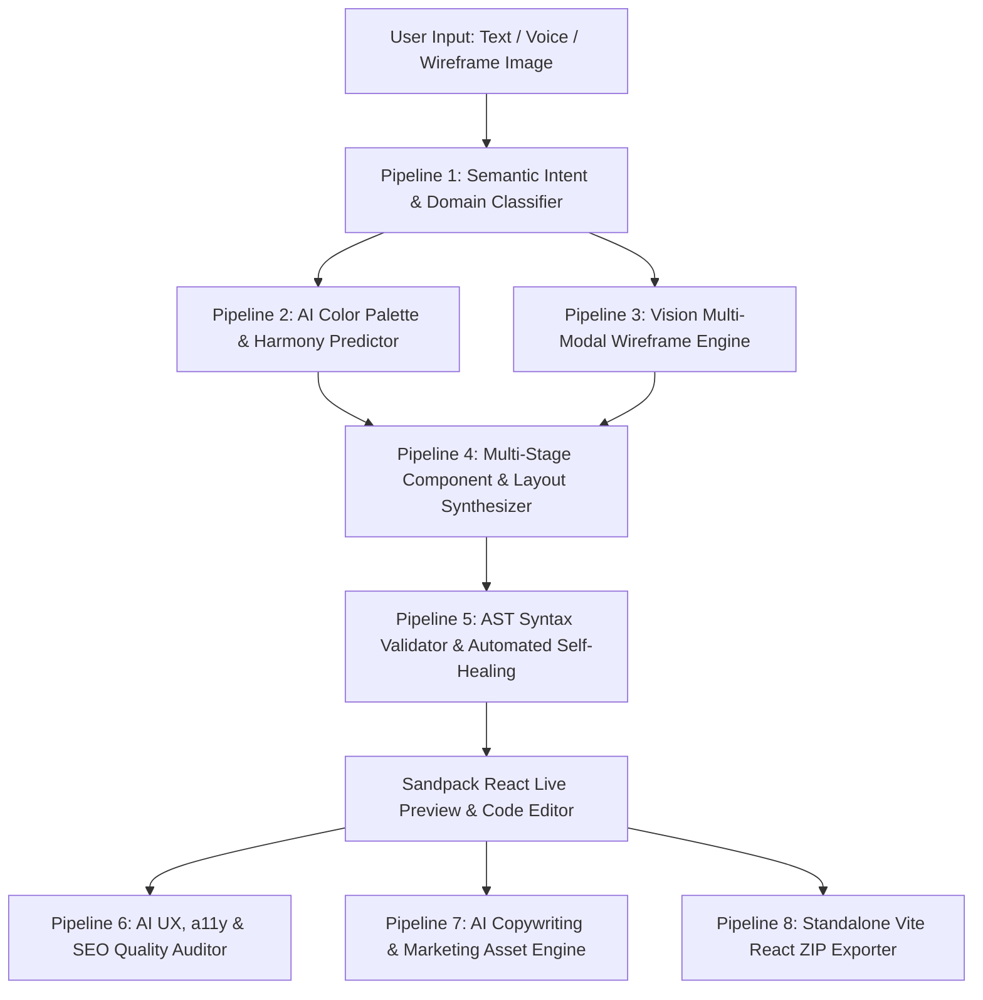

# 🚀 Craftly — Multi-Pipeline Machine Learning Web Studio

> **Transform natural language, voice commands, and hand-drawn wireframes into production-ready React web applications powered by 7+ intelligent ML pipelines.**

---

## 🌟 Overview & Architecture

Craftly is an AI-driven text-to-website synthesis studio designed for developers, designers, and creators. Unlike basic single-prompt wrappers, Craftly coordinates **7+ specialized Machine Learning and Computer Vision pipelines** to classify intent, compute WCAG-compliant harmonic color theory, translate wireframes into JSX, perform automated AST self-healing, and provide real-time UI/UX quality auditing.



---

## 🧠 7+ Machine Learning Pipelines

| Pipeline | Endpoint | Description |
| :--- | :--- | :--- |
| **1. Semantic Intent & Component Graph Classifier** | `/api/ml/classify-intent` | NLP zero-shot extraction determining website domain, target audience, visual tone, and planning an end-to-end component graph. |
| **2. Intelligent Palette Harmonizer** | `/api/ml/color-palette` | Generates 5-color aesthetic palettes with mathematical WCAG AA/AAA contrast ratio verification and real-time live site styling. |
| **3. Vision Wireframe-to-Code** | `/api/ml/vision-to-code` | Multi-modal neural vision model that parses hand-drawn paper sketches or UI screenshots directly into responsive Tailwind React code. |
| **4. Multi-Stage Code Synthesizer** | `/api/website-code` | Generates modern React components with Tailwind CSS, Lucide icons, responsive drawer, and bento grids. |
| **5. Automated AST Self-Healer** | `/api/ml/self-heal` | Auto-detects missing React imports, unclosed tags, or Lucide icon clashes and patches the code instantly. |
| **6. Real-Time UX & a11y Quality Auditor** | `/api/ml/quality-audit` | Computes 0-100 scores across Accessibility, SEO, UX, and Code Health with 1-click auto-fix actions. |
| **7. AI Copywriting & Conversion Engine** | `/api/ml/copy-optimizer` | Generates high-converting hero headlines, value propositions, and social proof based on brand niche. |
| **8. Standalone Project Bundler** | `lib/exportZip.js` | Generates complete, downloadable Vite + React project ZIP with `package.json`, `index.html`, and `src/App.jsx`. |

---

## 🛠️ Tech Stack

- **Framework**: Next.js 15 (App Router), React 18, Tailwind CSS
- **Live Code Runner**: Sandpack React (@codesandbox/sandpack-react)
- **AI & ML Engine**: Google Gemini Multimodal SDK (`gemini-2.0-flash`, `gemini-1.5-flash`, `gemini-1.5-pro`)
- **Backend & Database**: Convex Reactive DB / Hybrid Local Persistence
- **Speech & Audio**: Web Speech Recognition API
- **Export & Packaging**: Client-Side JSZip Bundler

---

## 🚀 Getting Started

### 1. Clone the repository
```bash
git clone https://github.com/Sanyam243/Kriti-Dev-Project.git
cd Kriti-Dev-Project
```

### 2. Install dependencies
```bash
npm install
```

### 3. Setup Environment Variables
Create a `.env.local` file in the root directory:
```env
NEXT_PUBLIC_GEMINI_API_KEY=your_gemini_api_key
NEXT_PUBLIC_CONVEX_URL=your_convex_url
NEXT_PUBLIC_GOOGLE_CLIENT_ID=your_google_client_id
NEXT_PUBLIC_PAYPAL_CLIENT_ID=your_paypal_client_id
```

### 4. Run Development Server
```bash
npm run dev
```
Open [http://localhost:3000](http://localhost:3000) in your browser.

---

## 📦 Features & Capabilities

- 🎨 **Live Sandpack In-Browser Editor**: Edit code on the fly and watch changes live with zero rebuild lag.
- 🛡️ **AI Quality Scorecard**: 1-click audit verifying WCAG AAA accessibility, SEO headings, and mobile UX responsiveness.
- 👁️ **Wireframe Sketch Upload**: Drag and drop any napkin sketch or wireframe screenshot to generate functional React code.
- 📦 **1-Click ZIP Export**: Instant download of standalone Vite React repository ready to run locally with `npm run dev`.
- 🎙️ **Voice Assistant Integration**: Speak your website ideas in natural language.
- 🌗 **Dark Glassmorphic UI**: Tailored modern aesthetics with smooth gradient backdrops and responsive mobile navigation.
